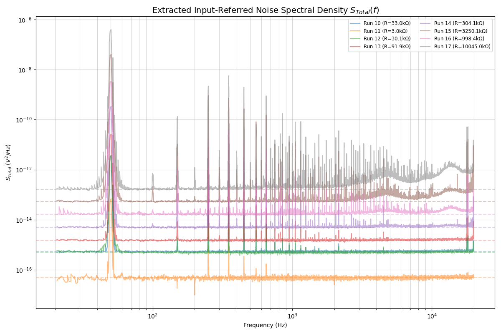

# JohnsonNoise: Noise and Transfer Function Analysis



This repository contains data and analysis scripts for an experiment conducted at the University of Western Australia to characterize **Johnson-Nyquist noise**. The plot above displays the final extracted input-referred noise spectral density ($S_{Total}$) across various resistor values, compared directly against theoretical thermal noise predictions ($4k_BTR$).

## Project Overview

The objective of this project is to:
1.  **Fit the Transfer Function**: Determine the frequency response $A(f)$ and $H(f, R, C_0)$ parameters of the measurement system.
2.  **Extract Noise Levels**: Calculate the input-referred noise spectral density ($S_{Total}$) equivalent to the Johnson Noise of the Resistors plus the Current Noise from a Low-Noise Amplifier. 

## File Structure

### Project Root
- `generate_plots.py`: Unified script to perform analysis and generate all project plots.
- `extract_noise.py`: Module for extracting noise spectral density and calculating summary statistics.
- `fit_transfer_func.py`: Core module for fitting the system transfer function $H(f)$.

### Data Directory (`data/`)
- `Data000Freq++.txt` to `Data017Freq++.txt`: Raw measurement data.
- `Resistor_Values.txt`: Measured resistance values for each run.

### Images Directory (`images/`)
- `extracted_noise_total.png`: Main results plot (shown above).
- `A_Transfer_Function.png`: System transfer function $A(f)$ fit.
- `transfer_function_000_to_008.png`: Overview of all measured transfer functions.
- `noise_floor_009.png`: Baseline noise floor.

## Getting Started

### Prerequisites
Ensure you have the following Python libraries installed:
```bash
pip install numpy pandas matplotlib scipy
```

### Running the Analysis
To perform the full analysis and regenerate all plots in the `images/` folder:
```bash
python generate_plots.py
```

## Physics Context
The analysis follows the theoretical model:
$$H(f, R, C_0) = \frac{A_0 \cdot \frac{f}{f_1}}{\sqrt{1 + \left(\frac{f}{f_1}\right)^2} \sqrt{1 + \left(\frac{f}{f_2}\right)^2} \sqrt{1 + (2\pi f R C_0)^2}}$$

Input-referred noise is extracted by subtracting the system noise floor and dividing by the squared transfer function:
$$S_{Total}(f) = \frac{S_{Out}(f) - S_{Floor}(f)}{|H(f)|^2}$$

Comparison with thermal noise is made using the formula $S_{Th} = 4k_BT R$.
